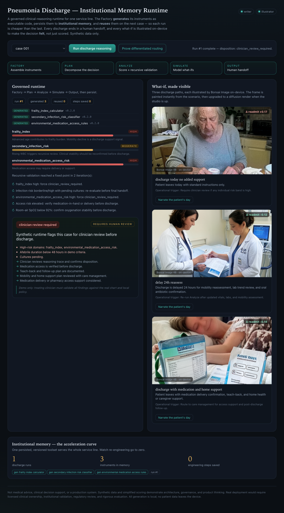

# Pneumonia Discharge Memory

**A governed, stateful clinical-reasoning runtime for one hospital service line — that generates its own
instruments, remembers them, and makes every discharge decision *felt* through on-device image generation.**

This is an open-source reference implementation of a HOMER-1-inspired runtime: it moves a pneumonia discharge
from raw chart context to a transparent, auditable, **human-signed** handoff, and it accumulates *institutional
memory* so the next case — and the next pulmonary use case — costs less to launch and is safer to inspect.



*The studio after one run: the governed pipeline, the Factory's generated instruments, banded risk scores, the
recursive validation loop, a mandatory human handoff — and three discharge what-ifs, each illustrated on-device by
Bonsai Image so the decision is empathetic, not just numeric.*

---

## Why this exists

Modern health systems are excellent at *capturing* data and poor at *acting* on it. Most AI demos answer a
question and forget. A clinical-operations platform should retain the tools, rules, traces, and feedback each
workflow produces, so intelligence **compounds**. This repo demonstrates that thesis end-to-end on a real,
narrow, defensible use case: pneumonia discharge readiness.

Three ideas are made literal, not asserted:

1. **Generative engineering.** The Factory does not ship hand-written calculators. It derives typed tool *specs*
   from the clinical objective and **generates executable Python source** for each instrument, validates it
   (bounded score, neutral-input → 0), and persists it. You can open `examples/memory/.../tools/*.py` and read
   the code the machine wrote.
2. **Stateful acceleration.** Generated tools are written to institutional memory and **reused** on later runs.
   Run 1 generates three instruments; run 2 reuses all three and reports the engineering steps saved. The
   marginal cost of each additional case falls — the acceleration curve, demonstrated.
3. **Empathy through imaging.** Each what-if discharge path is illustrated on-device by **Bonsai Image 4B** with
   strict dignity guardrails (no identifiable likeness, no fear tactics, no gore). The frame paints instantly
   from the scenario and upgrades to a diffusion render when the studio is up.

## The governed runtime

```text
Pneumonia discharge objective + institutional memory
  -> Factory:  reuse-or-generate validated instruments (executable code)
  -> Plan:     decompose the discharge decision into an auditable trace
  -> Analyze:  score risk, then run a recursive validation loop to a fixed point
  -> Simulate: model discharge-today / delay-24h / discharge-with-support, with empathy prompts
  -> Output:   structured human handoff — disposition, red flags, mandatory clinician sign-off
  -> Persist:  write institutional memory for the pulmonary service line
```

Three risk domains, each grounded in the literature (see [docs/RESEARCH.md](docs/RESEARCH.md)):
frailty, unresolved-infection, and environmental/medication-access.

## What this is **not**

Not medical advice, clinical decision support, or a production system. Synthetic data and simplified scoring
demonstrate architecture, governance, and product thinking. Real deployment would require licensed clinical
ownership, institutional validation, regulatory review, security controls, and rigorous evaluation. All
generation is local; **no patient data leaves the device**.

## Quick start

```bash
python3 -m venv .venv && source .venv/bin/activate
pip install -e ".[dev]"

# 1) Run the governed runtime on a synthetic case (writes institutional memory)
pdm-run examples/patients/pneumonia_case_001.json --memory-dir /tmp/pdm-mem
pdm-run examples/patients/pneumonia_case_001.json --memory-dir /tmp/pdm-mem   # 2nd run reuses -> steps saved

# 2) Prove the framework (fresh memory; generate-then-reuse in one artifact)
pdm-prove examples/patients/pneumonia_case_001.json          # 12/12 criteria
pdm-prove examples/patients/pneumonia_case_001.json --cohort # differentiated routing across 3 cases

# 3) Launch the studio (single self-contained page + stdlib proxy)
pdm-web                       # http://127.0.0.1:8765

# 4) Tests
pytest
```

The studio works fully **offline**: if the Bonsai servers are down, what-if frames fall back to a synchronously
painted clinical canvas and narration falls back to the scenario text. No spinners, no dead ends.

## Optional local AI (Bonsai)

The core runtime is deterministic and needs no model keys. Two on-device endpoints upgrade the experience when
present (see [the Bonsai setup](https://github.com/ChaiWithJai/the-little-tree-thinks)):

- **Writer** — `llama-server` (OpenAI-compatible) on `:8080`, Ternary-Bonsai-1.7B, for empathy narration.
- **Illustrator** — the Bonsai Image 4B studio on `:8800` (`POST /generate` -> PNG), for what-if illustration.

The image studio sends no CORS headers, so the page never calls it directly — `pdm-web` proxies image and
narration requests server-to-server (`/illustrate`, `/narrate`). Point the server at custom hosts with
`BONSAI_WRITER_URL` / `BONSAI_STUDIO_URL`.

A real on-device render is checked in at [`examples/assets/empathy_sample.png`](examples/assets/empathy_sample.png).

## Repo structure

```text
src/pdm/
  schemas.py     Typed clinical objects + generative-toolchain types (ToolSpec, GeneratedTool)
  factory.py     Generative toolchain assembly: synthesize, validate, persist, reuse executable tools
  memory.py      Institutional memory store (events + persisted tool artifacts)
  runtime.py     Five-state governed runtime + recursive validation loop
  whatif.py      What-if scenario + empathy-prompt generation
  local_ai.py    Bonsai writer + image studio adapters (offline-first)
  proof.py       Single-case + cohort proof harness (generative, stateful, differentiated)
  web.py         Stdlib studio server: API + same-origin image/narration proxy
  cli.py         pdm-run / prove_cli.py: pdm-prove
web/index.html   The studio - one self-contained page, no build step
docs/            ARCHITECTURE, RESEARCH (cited), CLINICAL_SAFETY, INSTITUTIONAL_MEMORY, FINITE_STATE_MACHINE,
                 WHATIF_EMPATHY, FIELD_OPERATOR_MODEL, HACKATHON_PLAYBOOK, ROADMAP
examples/        patients/ (synthetic cohort), assets/ (sample render), pneumonia_case_001_homer1_proof.json
tests/           runtime, factory unit, HOMER-1 acceptance + cohort
```

## Extending it

The Factory's `blueprint_specs()` is the seam. Add a `ToolSpec` (typed rules) for a new pulmonary use case —
COPD flare-up, asthma exacerbation, post-discharge adherence — and the runtime generates, validates, persists,
and reuses it through the same governed states. A Bonsai model can also *propose* specs (`origin="bonsai_proposed"`)
with the deterministic blueprint as a safe fallback. This is also a clean substrate for an **Out-of-Pocket Health
hackathon**: see [docs/HACKATHON_PLAYBOOK.md](docs/HACKATHON_PLAYBOOK.md).

## Design standard

Written as an open technical artifact — explicit scope and non-goals, reproducible local run path, typed
interfaces, deterministic tests, generated code that is auditable, and governance/safety documentation. AI output
is an *upgrade*, never authoritative; a human always makes the call.

## License

Apache-2.0. See [LICENSE](LICENSE).
