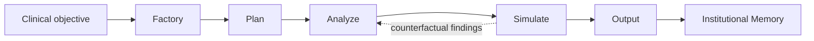

# Architecture

Pneumonia Discharge Memory applies a HOMER-1-inspired state machine to one service-line workflow: pneumonia discharge readiness.

## Runtime

## States

### Factory

Builds the instrument inventory:

- Frailty Index Calculator
- Secondary Infection Risk Classifier
- Environmental and Medication Access Rules
- What-if Scenario Template
- Structured Human Handoff Template

### Plan

Creates the auditable discharge-readiness trace:

- Vital stability.
- Lab trajectory.
- Mobility/frailty.
- Medication access.
- Home support.
- Simulation assumptions.
- Human handoff requirements.

### Analyze

Scores the synthetic case and runs recursive checks. The demo uses deterministic scoring so the architecture is inspectable and testable.

### Simulate

Creates what-if scenarios:

- Discharge today with standard instructions.
- Delay 24 hours and reassess.
- Discharge with medication delivery and home support.

### Output

Produces a structured human handoff. The output is not an order and not a recommendation to bypass clinical judgment.

### Persist

Writes an institutional memory event containing reusable assets, trace metadata, score bands, scenario names, and future pulmonary reuse targets.

## Local AI Integration Boundary

The runtime is deterministic. Local AI is optional and bounded to:

- Plain-language summary generation.
- Empathy-oriented image prompts.
- What-if engagement scenes.

Generated text and image outputs are never authoritative clinical evidence.

