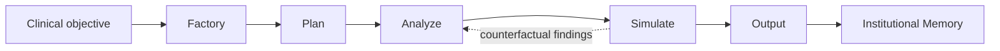

# Architecture

Pneumonia Discharge Memory applies a HOMER-1-inspired state machine to one service-line workflow: pneumonia discharge readiness.

## Runtime

## States

### Factory — generative toolchain assembly

The Factory does not ship hand-written calculators. It derives typed tool *specs* from the clinical objective
(`factory.blueprint_specs()`, or a Bonsai-proposed spec with the blueprint as fallback), **generates executable
Python source** for each instrument (`synthesize_source`), validates it (`validate_tool`: bounded score in
[0,1], neutral inputs -> 0), then either **reuses** a persisted artifact from institutional memory or generates
and persists a new one. The generated source is plain, auditable arithmetic over pre-extracted inputs — no eval
of patient data — written to `<memory>/tools/<name>@<version>.py`.

Instruments for the pneumonia use case:

- `frailty_index_calculator`
- `secondary_infection_risk_classifier`
- `environmental_medication_access_rules`

On a fresh service line these are generated (cold start). On every subsequent run they are reused, and the
`FactoryReport` records `engineering_steps_saved` — the acceleration curve.

### Plan

Creates the auditable discharge-readiness trace:

- Vital stability.
- Lab trajectory.
- Mobility/frailty.
- Medication access.
- Home support.
- Simulation assumptions.
- Human handoff requirements.

### Analyze

Scores the case with the generated instruments, then runs a **recursive validation loop to a fixed point**
(`runtime.recursive_validation`): each pass may add review triggers (high-band domains, borderline infection with
pending cultures, elevated access risk) and completeness flags (unknown procalcitonin, low room-air SpO2) until no
new finding fires. The iteration count is reported in `analyze_iterations`. Scoring is deterministic so the
architecture is inspectable and testable.

### Simulate

Creates what-if scenarios:

- Discharge today with standard instructions.
- Delay 24 hours and reassess.
- Discharge with medication delivery and home support.

### Output

Produces a structured human handoff. The output is not an order and not a recommendation to bypass clinical judgment.

### Persist

Writes an institutional memory event containing reusable assets, trace metadata, score bands, scenario names, and future pulmonary reuse targets.

## Local AI Integration Boundary

The runtime is deterministic. Local AI is optional and bounded to:

- Plain-language summary generation.
- Empathy-oriented image prompts.
- What-if engagement scenes.

Generated text and image outputs are never authoritative clinical evidence.

