# Finite State Machine

This repository treats HOMER-1 as a governed finite state machine for a synthetic pneumonia discharge workload. The runtime is intentionally deterministic so the use case can be tested without mocking clinical data, model calls, or image generation.

## State Contract

| State | Runtime responsibility | Pneumonia use-case evidence | Subsystems |
| --- | --- | --- | --- |
| Factory | Construct reusable instruments before reasoning. | Frailty index, secondary infection risk, environmental medication-access rules. | Instrument registry, validation metadata, safety limitations. |
| Plan | Decompose the discharge decision into auditable work. | Afebrile duration, WBC/procalcitonin trajectory, frailty, medication access, home support, what-if scenarios, human handoff. | Trace planner, data-gap representation, care-management routing. |
| Analyze | Run bounded scoring and recursive validation. | High frailty, moderate infection risk with pending cultures, high medication-access risk. | Rule engine, evidence extraction, recursive check loop. |
| Simulate | Compare operational alternatives before output. | Discharge today, delay 24h and reassess, discharge with medication and home support. | What-if engine, empathy prompt generator, non-authoritative media guardrails. |
| Output | Produce decision-ready handoff for humans. | Clinician review required, red flags, actions to consider, clinician validation note. | Handoff renderer, red-flag summarizer, human sign-off boundary. |
| Persist | Store reusable institutional memory. | Pulmonary service-line event with reusable assets and future COPD/asthma/adherence targets. | JSONL memory store, reuse target catalog, PHI boundary. |

## State Machine Chart

```mermaid
stateDiagram-v2
    [*] --> Factory
    Factory --> Plan: instruments declared and safety metadata present
    Plan --> Analyze: auditable trace covers clinical + operational checks
    Analyze --> Simulate: scores bounded and recursive checks complete
    Simulate --> Output: scenarios include assumptions + operational triggers
    Output --> Persist: human handoff includes red flags + sign-off boundary
    Persist --> [*]: memory event written for service-line reuse

    state Factory {
        [*] --> InstrumentRegistry
        InstrumentRegistry --> ValidationMetadata
        ValidationMetadata --> SyntheticSafetyLimits
    }

    state Plan {
        [*] --> ClinicalTrace
        ClinicalTrace --> OperationalTrace
        OperationalTrace --> HumanHandoffPlan
    }

    state Analyze {
        [*] --> RiskScoring
        RiskScoring --> EvidenceItems
        EvidenceItems --> RecursiveValidationLoop
    }

    state Simulate {
        [*] --> ScenarioComparison
        ScenarioComparison --> EmpathyPrompts
        EmpathyPrompts --> MediaGuardrails
    }

    state Output {
        [*] --> RedFlags
        RedFlags --> ActionsToConsider
        ActionsToConsider --> ClinicianReviewRequired
    }

    state Persist {
        [*] --> MemoryEvent
        MemoryEvent --> ReusableAssets
        ReusableAssets --> FutureServiceLineTargets
    }
```

## Acceptance Criteria

The executable proof harness in `src/pdm/proof.py` must pass all criteria for the synthetic case:

- Factory constructs all three pneumonia instruments and every instrument declares validation checks plus limitations.
- Plan includes clinical stability, infection trend, medication access, home support, what-if, and handoff work.
- Analyze emits bounded scores for frailty, infection, and environmental medication access.
- Recursive validation catches high-risk domains, pending cultures, and medication-in-hand risk.
- Simulate generates one risk-increasing and two risk-reducing operational alternatives.
- Empathy prompts are present but explicitly non-authoritative.
- Output requires clinician review and surfaces red flags and actions to consider.
- Persist writes pulmonary service-line memory with reuse targets beyond pneumonia.
- Governance prevents autonomous clinical orders and preserves the synthetic-only boundary.
- Runtime state order is exactly Factory -> Plan -> Analyze -> Simulate -> Output before persistence.

## Testing Trophy

The test suite follows a testing trophy shape:

- Unit tests validate instrument scoring, bands, memory persistence, and proof criteria without network calls.
- Integration tests run the full pneumonia case through the runtime and verify state order, handoff, scenarios, and memory.
- Acceptance tests run the same public example through the proof harness and assert every HOMER-1 criterion passes.
- No model, image, calendar, email, or external API calls are mocked because the core workflow has no external runtime dependency.
